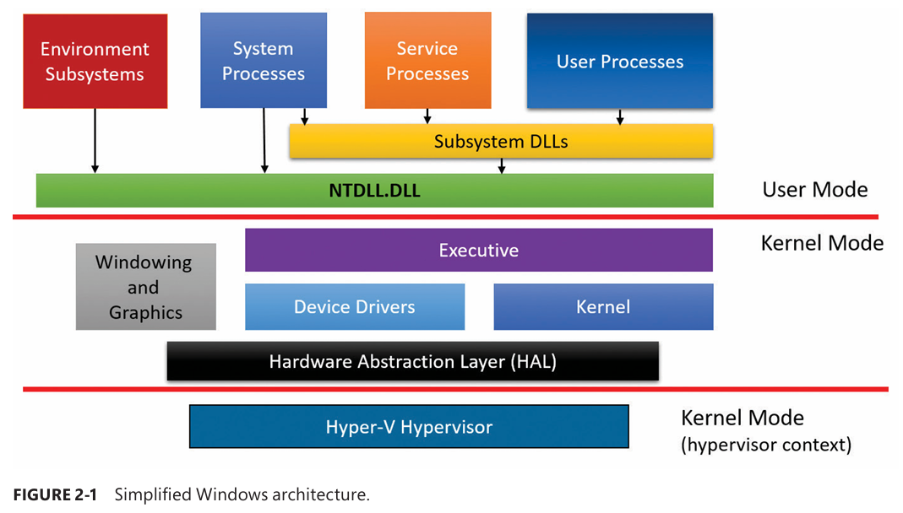

# Windows Architecture – Chapter 2 Notes (Core Components)

## 1. High-Level Architecture Overview

- Windows is divided into **user mode** and **kernel mode**
    
- A simplified architecture diagram (Figure 2-1) shows:
    
    - User-mode processes above the boundary
        
    - Kernel-mode OS services below the boundary
        
- Diagram is **not exhaustive**:
    
    - Networking stack details omitted
        
    - Device driver layering omitted
        

---

## 2. Execution Modes & Privilege Boundaries

### User Mode

- Threads run in a **private process address space**
    
- When entering kernel mode (via system calls), threads gain access to **system space**
    
- Each of the following has its **own private address space**:
    
    - User processes
        
    - Service processes
        
    - System processes
        
    - Environment subsystem processes
        

### Kernel Mode

- Contains core OS services and drivers
    
- Has unrestricted access to system memory and hardware
    

### Hypervisor Boundary

- A second boundary exists **below kernel mode**
    
- Hypervisor:
    
    - Runs at **CPU privilege level 0**, same as kernel
        
    - Uses hardware virtualization extensions:
        
        - Intel VT-x
            
        - AMD SVM
            
    - Can **isolate itself from the kernel** and monitor kernel + apps
        
- Term **“Ring -1”** is commonly used but technically **inaccurate**
    

---

## 3. Types of User-Mode Processes

### 1. User Processes

- Application processes
    
- Supported types:
    
    - Win32 (32-bit / 64-bit)
        
    - Windows Runtime apps (Windows 8+)
        
    - Windows 3.1 (16-bit) – 32-bit Windows only
        
    - MS-DOS (16-bit) – 32-bit Windows only
        
    - POSIX (32-bit / 64-bit) – **deprecated**
        
- Notes:
    
    - 16-bit apps **cannot run on 64-bit Windows**
        
    - POSIX support removed starting Windows 8
        

---

### 2. Service Processes

- Host **Windows services**
    
- Started by **Service Control Manager (SCM)**
    
- Run independently of user logon
    
- Examples:
    
    - Task Scheduler
        
    - Print Spooler
        
    - SQL Server, Exchange (server workloads)
        

---

### 3. System Processes

- Fixed, **hardwired OS processes**
    
- Not services and **not started by SCM**
    
- Examples:
    
    - Session Manager (smss.exe)
        
    - Logon process (winlogon.exe)
        

---

### 4. Environment Subsystem Server Processes

- Implement **OS personality / environment**
    
- Historically supported:
    
    - Windows
        
    - POSIX
        
    - OS/2
        
- Status:
    
    - OS/2: last shipped in Windows 2000
        
    - POSIX: last shipped in Windows XP
        
    - SUA (Subsystem for UNIX-based Applications):
        
        - Present in Windows 7 (Ultimate/Enterprise) and Windows Server 2008 R2
            
        - **Now discontinued**
            
- WSL:
    
    - Introduced in Windows 10 v1607 (beta)
        
    - **Not a traditional environment subsystem**
        
    - Uses **Pico processes/providers** (Only for version 1)
        
    - Discussed in later chapters
        

---

## 4. Subsystem DLLs (User-Mode API Layer)

- User applications **do not call kernel services directly**
    
- Instead, they call **subsystem DLLs**
    
- Role of subsystem DLLs:
    
    - Translate **documented APIs** into:
        
        - Native system calls
            
        - Mostly implemented in `Ntdll.dll`
            
    - Translation may:
        
        - Directly invoke system calls
            
        - Or send messages to environment subsystem servers
            
- Examples:
    
    - Kernel32.dll
        
    - User32.dll
        
    - Gdi32.dll
        
    - Advapi32.dll
        

---

## 5. Kernel-Mode Components

### Windows Executive

- High-level OS services:
    
    - Memory management
        
    - Process & thread management
        
    - Security
        
    - I/O
        
    - Networking
        
    - IPC
        

---

### Windows Kernel

- Low-level mechanisms:
    
    - Thread scheduling
        
    - Interrupt & exception handling
        
    - Multiprocessor synchronization
        
- Provides **primitive objects & routines** used by the executive
    

---

### Device Drivers

- Run in kernel mode
    
- Two types:
    
    - Hardware drivers (device-specific)
        
    - Non-hardware drivers:
        
        - File systems
            
        - Network stack
            

---

### Hardware Abstraction Layer (HAL)

- Isolates OS from **platform-specific hardware differences**
    
- Shields kernel and drivers from:
    
    - Motherboard differences
        
    - Interrupt controller differences
        

---

### Windowing & Graphics System

- Kernel-mode GUI implementation
    
- Implements:
    
    - USER
        
    - GDI
        
- Responsibilities:
    
    - Window management
        
    - UI controls
        
    - Drawing operations
        

---

### Hypervisor Layer

- Single component: **the hypervisor**
    
- No traditional drivers
    
- Internally contains:
    
    - Memory manager
        
    - Virtual processor scheduler
        
    - Interrupt/timer management
        
    - Synchronization
        
    - Partition (VM) management
        
    - Inter-partition communication (IPC)
        

---

## 6. Core Windows System Files (Table 2-1)

|File Name|Component|
|---|---|
|**Ntoskrnl.exe**|Executive + kernel|
|**Hal.dll**|Hardware Abstraction Layer|
|**Win32k.sys**|Kernel-mode GUI (USER + GDI)|
|**Hvix64.exe / Hvax64.exe**|Hypervisor (Intel / AMD)|
|**\System32\Drivers\*.sys**|Core drivers (DX, TCP/IP, TPM, ACPI, Volume Manager)|
|**Ntdll.dll**|Native system calls + internal support|
|**Kernel32.dll**|Core Win32 API|
|**Advapi32.dll**|Security, registry, services|
|**User32.dll**|User interface APIs|
|**Gdi32.dll**|Graphics APIs|