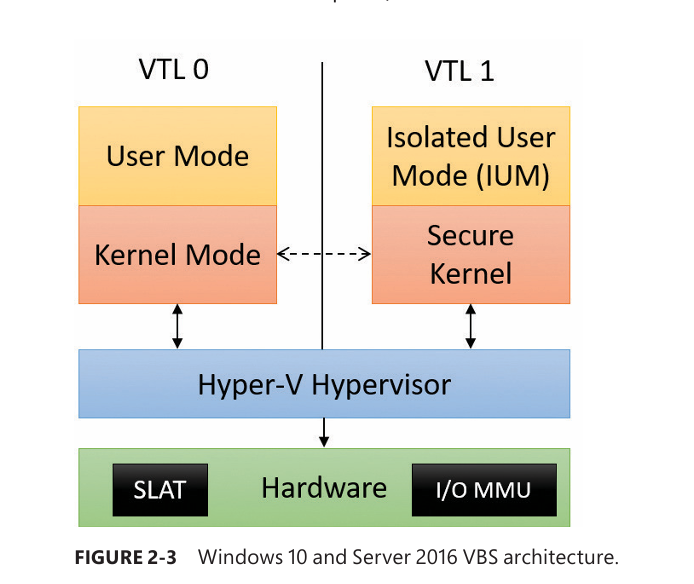

# Virtualization-Based Security (VBS) – Architecture Notes

## 1. Motivation: Why VBS Exists

- Traditional protection boundary:
    
    - **User mode vs Kernel mode**
        
- Problem:
    
    - If **malicious kernel-mode code** runs (vulnerable driver, kernel exploit), the system is **fully compromised**
        
- Solution:
    
    - Use the **hypervisor** to introduce stronger isolation
        
    - Extend protection **beyond CPU privilege levels**
        

---

## 2. Virtualization-Based Security (VBS)

- VBS uses the **hypervisor** to create stronger security guarantees
    
- Introduces **Virtual Trust Levels (VTLs)**
    
- Also called:
    
    - **Virtual Secure Mode (VSM)**
        

### Key idea

- **Privilege (ring 0 vs ring 3)** = power
    
- **VTL (VTL 0 vs VTL 1)** = isolation
    

---

## 3. Virtual Trust Levels (VTLs)

### VTL 0

- Normal Windows environment
    
- Contains:
    
    - Standard kernel
        
    - Device drivers
        
    - User-mode applications
        

### VTL 1

- Higher trust, isolated environment
    
- Contains:
    
    - **Secure kernel**
        
    - **Isolated User Mode (IUM)** processes
        
- Regular kernel **cannot control or define** VTL 1 resources
    

---

## 4. VBS Architecture (Windows 10 1607+, Server 2016+)

- Hyper-V hypervisor always present if hardware supports it
    
- VBS enabled by default on supported systems
    
- Older Windows 10 versions:
    
    - Enabled via policy or **Isolated User Mode** feature
        

---

## 5. Secure Kernel

- Runs in:
    
    - **Kernel mode (ring 0)**
        
    - **VTL 1**
        
- Binary:
    
    - `securekernel.exe`
        
- Characteristics:
    
    - Separate kernel from NT kernel
        
    - Also called a **proxy kernel**
        
    - Does **not** implement full OS functionality
        
    - Carefully forwards selected system calls to VTL 0
        

### Capabilities

- Full access to:
    
    - VTL 0 memory
        
    - VTL 0 resources
        
- Can **restrict VTL 0 access** using hardware virtualization
    

---

## 6. Isolated User Mode (IUM)

### What IUM Is

- A restricted user-mode environment
    
- Runs at:
    
    - **Ring 3**
        
    - **VTL 1**
        

### Purpose

- Run sensitive user-mode components securely
    
- Enforce:
    
    - Restricted system calls
        
    - Restricted DLL loading
        

---

### IUM System Call Interface

- Uses VTL 1 equivalents of standard DLLs:
    
    - `Iumdll.dll` → VTL 1 version of `Ntdll.dll`
        
    - `Iumbase.dll` → VTL 1 version of `Kernelbase.dll`
        
- Adds **secure system calls**
    
    - Executable only in VTL 1
        

---

### Memory Efficiency

- Shares most Win32 user-mode libraries with VTL 0
    
- **Copy-on-write** ensures:
    
    - VTL 0 cannot modify VTL 1 binaries
        

---

## 7. Privilege vs Isolation Rules (Critical Concept)

### Rules Summary

- VTL 0 kernel ❌ cannot access VTL 1
    
- VTL 1 user ❌ cannot access VTL 0 kernel
    
- Ring rules still apply:
    
    - Ring 3 ❌ Ring 0
        
- VTL 1 apps:
    
    - Are **not more powerful**
        
    - Are often **less capable**
        

### Mental Model

- **Privilege = power**
    
- **VTL = isolation**
    
- VTL 1 ≠ more authority, just stronger containment
    

---

## 8. Secure Kernel Restrictions

- Secure kernel **blocks**:
    
    - File I/O
        
    - Network I/O
        
    - Registry access
        
    - Graphics
        
    - Driver communication
        
- No device drivers allowed
    
- Very small attack surface
    

---

## 9. Hardware Enforcement Mechanisms

### SLAT (Second Level Address Translation)

- Hardware-assisted memory isolation
    
- Used to:
    
    - Hide memory from VTL 0 kernel
        
    - Protect secrets
        

#### Enables:

- **Credential Guard**
    
    - Stores secrets in VTL 1–protected memory
        
- **Device Guard**
    
    - Controls execution of memory regions
        

---

### I/O MMU (DMA Protection)

- Prevents devices from:
    
    - Using DMA to bypass SLAT
        
- Stops malicious drivers from:
    
    - Directly accessing hypervisor or secure kernel memory
        

---

## 10. Secure Boot & Execution Flow

1. Boot loader launches **hypervisor first**
    
2. Hypervisor:
    
    - Configures SLAT
        
    - Configures I/O MMU
        
    - Defines VTL 0 and VTL 1
        
3. Boot loader runs again in **VTL 1**
    
4. Secure kernel loads
    
5. Secure kernel configures protections
    
6. System drops to **VTL 0**
    
7. Normal kernel runs:
    
    - Fully sandboxed
        
    - Cannot escape VTL 0
        

---

## 11. Trustlets (Critical Security Component)

### What Are Trustlets

- Special **VTL 1 user-mode binaries**
    
- Only allowed executables in VTL 1
    
- Must be:
    
    - Specially signed by Microsoft
        
    - Known to the secure kernel
        

### Properties

- Unique identifier per Trustlet
    
- Cannot be:
    
    - Modified
        
    - Patched
        
    - Created by third parties
        
- Prevents malicious VTL 1 code execution
    

---

## 12. Security Implications

- Prevents:
    
    - Kernel credential theft
        
    - Malicious drivers from accessing secrets
        
- Even compromised kernel:
    
    - Cannot read Credential Guard secrets
        
- Strong defense against:
    
    - Pass-the-hash
        
    - LSASS dumping
        
    - DMA attacks
        

---

## 13. Future Directions

- Secure devices:
    
    - Biometrics
        
    - Smartcards
        
- Possible future components:
    
    - Secure HAL
        
    - Secure PnP manager
        
    - Secure UMDF
        
- Direct device access from VTL 1 (fully isolated)
    

---

## 14. Key Takeaways

- VBS adds **hardware-enforced isolation**
    
- VTLs extend security beyond rings
    
- Secure kernel = minimal, proxy-based
    
- Trustlets prevent VTL 1 abuse
    
- Hypervisor is the **true root of trust**