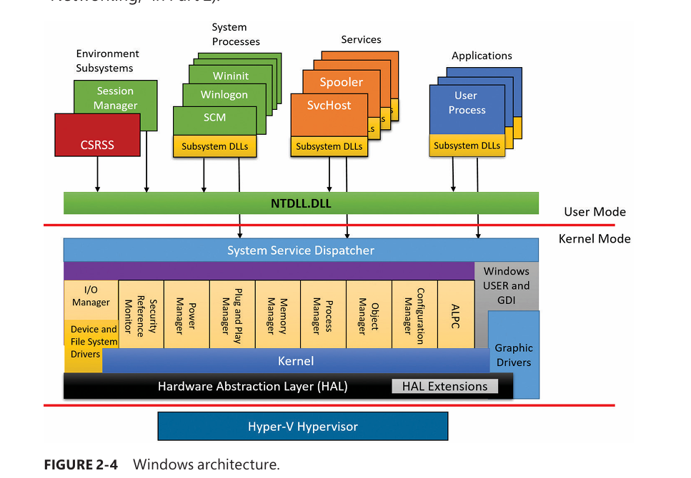

# Key System Components



## 1. Expanded System Architecture Overview

- Figure 2-4 presents a **more complete view** of Windows core architecture than earlier diagrams
    
- Still omits some areas (notably **networking**, covered in Chapter 10)
    
- Later chapters cover:
    
    - Control mechanisms (objects, interrupts, ALPC)
        
    - Startup & shutdown
        
    - Registry, services, WMI
        
    - Processes, threads, memory, I/O, storage, cache, NTFS, security, networking
        

---

## 2. Environment Subsystems

- Purpose:
    
    - Expose a **subset of Windows executive services** to applications
        
- Each subsystem:
    
    - Provides different APIs
        
    - Can limit what applications can do
        
    - Example: Windows apps cannot use POSIX `fork()`
        

### Subsystem Binding

- Each `.exe` is bound to **exactly one subsystem**
    
- Subsystem type stored in the PE header
    
- Defined at link time via:
    
    - `/SUBSYSTEM` linker option
        
- OS checks this value during process creation
    

---

## 3. Subsystem DLLs (User-Mode Gatekeepers)

- Applications **never call kernel services directly**
    
- They call **subsystem DLLs**, which expose documented APIs
    

### Examples

- Windows subsystem:
    
    - `Kernel32.dll`
        
    - `Advapi32.dll`
        
    - `User32.dll`
        
    - `Gdi32.dll`
        
- POSIX/SUA (historical):
    
    - `Psxdll.dll`
        

---

## 4. What Happens When an App Calls an API

When a subsystem DLL function is called, one of three things happens:

### 1. User-mode only

- Function implemented entirely in user mode
    
- No kernel transition
    
- Examples:
    
    - `GetCurrentProcess`
        
    - `GetCurrentProcessId`
        

---

### 2. Calls into the Windows executive

- Subsystem DLL invokes internal system calls
    
- Examples:
    
    - `ReadFile` → `NtReadFile`
        
    - `WriteFile` → `NtWriteFile`
        

---

### 3. Client/server request to subsystem process

- Uses **ALPC**
    
- Subsystem process maintains application state
    
- Subsystem DLL blocks waiting for response
    
- Examples:
    
    - Process creation
        
    - Shutdown (`ExitWindowsEx`)
        
- Some APIs combine **(2) and (3)** (e.g., `CreateProcess`)
    

---

## 5. Subsystem Startup

- Subsystems started by **Session Manager (Smss.exe)**
    
- Configuration stored in:
    
    `HKLM\SYSTEM\CurrentControlSet\Control\Session Manager\SubSystems`
    

### Key Registry Values

- **Required**
    
    - Always loaded at boot
        
    - `Windows` → `Csrss.exe`
        
- **Optional**
    
    - Loaded on demand
        
    - Empty on modern Windows (SUA removed)
        
- **Kmode**
    
    - Kernel-mode component
        
    - `Win32k.sys`
        

---

## 6. Windows Subsystem (Mandatory)

- Central subsystem for all Windows systems
    
- Other subsystems rely on it for:
    
    - Display I/O
        
- Always running—even on servers
    
- Marked as a **critical process**
    
    - If it exits → system crash
        

---

## 7. Windows Subsystem Components

### A. User-Mode Components

#### 1. Csrss.exe (per session)

Loads multiple DLLs:

- `Basesrv.dll`
    
- `Winsrv.dll`
    
- `Sxssrv.dll`
    
- `Csrsrv.dll`
    

Provides:

- Process & thread lifecycle support
    
- Application shutdown
    
- INI → registry compatibility
    
- Kernel event to window message translation
    
- Partial 16-bit VDM support (32-bit Windows)
    
- Side-by-side (SxS) & manifest caching
    
- Natural language caching
    

**Special notes**

- Input & desktop threads run inside `Winsrv.dll`
    
- Interactive sessions also load:
    
    - `Cdd.dll` (Canonical Display Driver)
        
    - Responsible for VSync-based desktop rendering via DirectX
        

---

#### 2. Conhost.exe (Console Window Host)

- Handles console windows
    
- Supports character-based applications
    

---

#### 3. Dwm.exe (Desktop Window Manager)

- Composites window content
    
- Uses DirectX + CDD
    
- Produces final desktop image
    

---

### B. Kernel-Mode Components

#### 1. Win32k.sys

Contains:

- Window Manager
    
- GDI (Graphics Device Interface)
    
- Wrappers for DirectX (`Dxgkrnl.sys`)
    

Functions:

- Input handling (keyboard, mouse)
    
- Window display management
    
- Message delivery
    
- Graphics rendering coordination
    

---

#### 2. Graphics Drivers

- Display drivers
    
- Printer drivers
    
- Video miniport drivers
    

---

## 8. Win32k.sys Modularization (Windows 10+)

### Motivation

- Different devices have different UI needs
    
- Reduce:
    
    - Code complexity
        
    - Attack surface
        

### Modules

- **Desktop systems**
    
    - `Win32kBase.sys`
        
    - `Win32kFull.sys`
        
- **Mobile devices**
    
    - `Win32kBase.sys`
        
    - `Win32kMin.sys`
        
- **IoT**
    
    - `Win32kBase.sys` only
        

---

## 9. Graphics Flow (High-Level)

1. Application calls USER API
    
2. Window manager processes request
    
3. GDI formats output
    
4. Graphics driver renders to hardware
    
5. Miniport driver completes display support
    

### GDI Role

- Hardware-independent 2D graphics API
    
- Translates abstract drawing requests into device-specific commands
    
- Breaks complex operations into primitives if needed
    

---

## 10. Kernel vs User Mode Interaction (Key Insight)

- Most display I/O runs **in kernel mode**
    
- Only a small number of APIs cause:
    
    - ALPC messages to Csrss.exe
        
- Context switches mostly happen for:
    
    - Cursor updates
        
    - Keyboard input
        
    - Screen redraws
        

---

## 11. Console Architecture Evolution

### Pre-Windows 7

- Csrss.exe handled all console I/O
    

### Windows 7

- Each console window has its own `Conhost.exe`
    
- Reduced Csrss load
    

---

### Windows 8+

- Console driver introduced:
    
    - `ConDrv.sys`
        
- `Conhost.exe`:
    
    - Spawned by console application
        
    - Communicates via I/O requests (not ALPC)
        
- Benefits:
    
    - Fewer context switches
        
    - Faster input/output
        
    - Cleaner architecture
        

### Key Details

- Console apps communicate directly via:
    
    - Read / Write / IOCTL to `\Device\ConDrv`
        
- Main logic in:
    
    - `ConhostV2.dll`
        

---

## 12. Key Takeaways

- Environment subsystems define **application personality**
    
- Subsystem DLLs are the **API boundary**
    
- Windows subsystem is mandatory and critical
    
- GUI and console are both Windows subsystem variants
    
- Display & input are largely kernel-mode
    
- Modern Windows reduces attack surface via modular Win32k
    
- Console I/O redesigned to minimize overhead

## 13. Boot / Session Creation Flow
```
Kernel
  ↓
SMSS.exe
  ├─ reads SubSystems registry
  ├─ loads Win32k.sys
  ├─ creates Session 0
  ├─ starts Csrss.exe (Session 0)
  └─ on user logon:
       ├─ creates new session
       ├─ starts new Csrss.exe
       └─ starts Winlogon.exe
```

## 14. Runtime Flow
```
App → Subsystem DLL (Kernel32/User32)
      ├─ Direct kernel syscall (ntdll → ntoskrnl)
      └─ ALPC message → CSRSS → response

```

## Convo with ChatGPT
## 1. Your Mental Model (Partly Right, But Incomplete)

You’re correct that a subsystem defines:

- A **programming model** (APIs, semantics, behaviors)
    
- Rules for:
    
    - Process creation
        
    - I/O
        
    - Signals / messages
        
    - Error handling
        
    - ABI expectations
        

But in Windows, that model is **not purely passive**.

Unlike a C library, **Windows subsystems are active entities**.

---

## 2. What a Windows Subsystem Actually Is

A Windows environment subsystem consists of **three parts**:

### 1️⃣ Subsystem DLLs (User-mode API layer)

Examples:

- `Kernel32.dll`
    
- `User32.dll`
    
- `Advapi32.dll`
    
- `Gdi32.dll`
    
- (POSIX/SUA: `Psxdll.dll`)
    

These:

- Export documented APIs
    
- Translate API calls into:
    
    - Native syscalls (`ntdll → ntoskrnl`)
        
    - OR IPC requests (ALPC) to a server process
        

📌 **These alone are NOT the subsystem**

---

### 2️⃣ Subsystem Server Process (User-mode, stateful)

Example:

- **`Csrss.exe`** (Windows subsystem)
    
- (Historical: `Psxss.exe`, `Os2ss.exe`)
    

This is where the “starting” part comes in.

This process:

- Maintains **global and per-session state**
    
- Handles requests that:
    
    - Cannot live in the kernel
        
    - Cannot live in stateless DLLs
        
- Acts as a **client/server endpoint** for subsystem operations
    

📌 This is an **executable that must be running**

---

### 3️⃣ Kernel-Mode Support

Examples:

- `Win32k.sys` (GUI, input, GDI)
    
- Executive services (`ntoskrnl.exe`)
    

These:

- Enforce subsystem semantics
    
- Handle performance-critical paths
    
- Provide isolation and security
    

📌 Loaded by the kernel / SMSS

---

## 3. So What Does “Starting a Subsystem” Mean?

When Windows Internals says:

> _“Subsystems are started by the Session Manager (Smss.exe)”_

It means:

### ✔️ SMSS launches the **subsystem server process**

and

### ✔️ Ensures required **kernel-mode components** are loaded

Not “start APIs”.

---

## 4. Concrete Example: Windows Subsystem Startup

### At Boot / Session Creation

1. **Kernel starts SMSS.exe**
    
2. **SMSS reads registry**:
    
    `HKLM\SYSTEM\CurrentControlSet\Control\Session Manager\SubSystems`
    
3. Finds:
    
    `Windows = Csrss.exe ObjectDirectory=... Kmode = Win32k.sys`
    
4. SMSS:
    
    - Loads `Win32k.sys`
        
    - Creates Session X
        
    - **Executes `Csrss.exe` inside that session**
        

🎯 **That is “starting the Windows subsystem”**

---

## 5. Why Can’t Subsystems Be “Just APIs”?

Because many things require **persistent, trusted, centralized state**.

Examples:

### 🔹 Process & Thread Bookkeeping

- Who owns what?
    
- Session boundaries
    
- Cleanup on crash
    

### 🔹 Console & Legacy Semantics

- Console state
    
- Ctrl+C handling
    
- 16-bit support (historically)
    

### 🔹 GUI & Input Coordination

- Desktop threads
    
- Input routing
    
- Shutdown/logoff orchestration
    

### 🔹 Security Boundaries

- Controlled IPC
    
- Privilege separation
    
- Attack surface reduction
    

A DLL:

- Is **stateless**
    
- Runs in **untrusted process context**
    
- Can be unloaded or tampered with
    

So Windows needs a **trusted server process**.

---

## 6. Is a Subsystem a Binary?

### ✅ Yes — partially

|Component|Binary?|
|---|---|
|Subsystem DLLs|Yes (`.dll`)|
|Subsystem server|**Yes (`.exe`)**|
|Kernel support|Yes (`.sys`)|

When people say _“the Windows subsystem”_, they mean **the whole bundle**, not just one file.

---

## 7. Why Only One Subsystem Per Process?

Each `.exe` has:

`IMAGE_SUBSYSTEM_WINDOWS_GUI IMAGE_SUBSYSTEM_WINDOWS_CUI IMAGE_SUBSYSTEM_POSIX`

This tells the kernel:

- Which **subsystem server** to notify
    
- Which **rules apply**
    
- Which **APIs are valid**
    

You can’t mix semantics safely.

---

## 8. Why This Design Matters (Security & Stability)

This architecture:

- Prevents user apps from:
    
    - Directly manipulating GUI internals
        
    - Bypassing shutdown / logoff rules
        
- Makes subsystems:
    
    - Replaceable (historically)
        
    - Containable
        
    - Auditable
        

It’s also why:

- Killing CSRSS = BSOD
    
- Subsystem misbehavior is **system-fatal**
    

---

## 9. Final Intuition (Best Way to Remember)

> **APIs define the language.  
> DLLs translate the language.  
> Subsystem servers enforce the rules.  
> Starting a subsystem = starting the enforcer.**