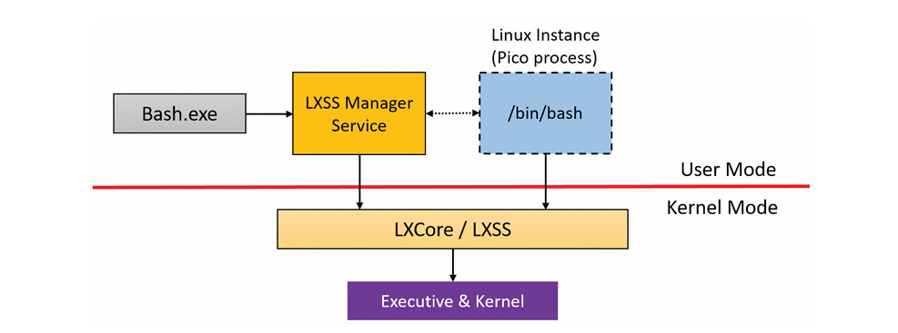

## Other Windows Subsystems (Overview)

- Early versions of Windows supported **POSIX** and **OS/2** subsystems.
    
- These are **no longer included**, so they aren’t covered in detail.
    
- The **subsystem concept still exists**, allowing Windows to remain extensible if new subsystems are needed in the future.
    

---

## Limitations of the Traditional Subsystem Model

The classic subsystem approach (used by POSIX/SUA and OS/2) had major drawbacks:

1. **Requires PE recompilation**
    
    - Subsystem type is stored in the **PE header**
        
    - Non-Windows binaries must be **rebuilt as Windows `.exe` files**
        
    - POSIX calls are wrapped into Windows APIs (e.g., `Psxdll.dll`)
        
2. **Wrapping, not emulation**
    
    - Subsystems rely on **NT kernel + Win32 behavior**
        
    - Semantics are approximated, not exact
        
    - Leads to subtle incompatibilities
        
3. **Designed for POSIX, not Linux**
    
    - SUA targeted UNIX-era POSIX apps
        
    - Modern Linux applications have different expectations
        

These limitations prevented broad adoption for running real Linux binaries.

---

## Pico Providers: A New Subsystem Model

To overcome these issues, Microsoft introduced the **Pico model**, inspired by the **Drawbridge** research project.

### Key Concept: Pico Provider

- A **kernel-mode driver**
    
- Registers via `PsRegisterPicoProvider`
    
- Acts as a **mini–kernel personality layer**
    

### Capabilities of a Pico Provider:

- Create **Pico processes and threads**
    
- Customize execution context and kernel structures (`EPROCESS`, `ETHREAD`)
    
- Receive detailed **kernel notifications**, including:
    
    - System calls
        
    - Exceptions
        
    - APCs
        
    - Page faults
        
    - Context switches
        
    - Thread/process lifecycle events
        

This gives the provider deep control over process behavior.

---

## Windows Subsystem for Linux (WSL)

- Introduced in **Windows 10 v1607**
    
- Implemented via Pico providers:
    
    - `Lxss.sys`
        
    - `Lxcore.sys`
        
- These drivers form the **WSL Pico provider**
    

### Pico Processes (WSL)

- **Very different from Windows processes**
    
- Do **not** load `ntdll.dll`
    
- Contain Linux-specific structures (e.g., **vDSO**)
    
- Run **unmodified Linux binaries** (no PE format, no recompilation)
    

---

## User-Mode Coordination (WSL)

Since Windows cannot natively launch Linux binaries:

- A **user-mode service (LXSS Manager)** coordinates execution
    
- Communication stack:
    
    - Pico provider ↔ LXSS Manager (private interface)
        
    - LXSS Manager ↔ launcher (`bash.exe`)
        
    - LXSS Manager ↔ management tools (`lxrun.exe`) via COM
        

This infrastructure enables transparent Linux process startup and management.

---

## Linux Compatibility Work in WSL

Supporting Linux apps required substantial reimplementation:

### File System

- Uses **NTFS** for storage
    
- Implements full **Linux VFS layer**:
    
    - Inodes
        
    - `inotify`
        
    - `/proc`, `/sys`, `/dev`
        
- Linux semantics preserved despite NTFS backing
    

### Networking

- Uses Windows **WSK**
    
- Wraps behavior to support:
    
    - UNIX domain sockets
        
    - Netlink sockets
        
    - Internet sockets
        

### IPC

- Windows named pipes (`Npfs.sys`) were incompatible
    
- Linux pipes were **reimplemented from scratch**
    

---

## Status and Outlook

- WSL was **beta** at the time of writing
    
- APIs and internals subject to change
    
- Pico processes are revisited in later chapters
    
- Future releases expected to bring:
    
    - Stable APIs
        
    - Official documentation
        
    - Deeper Windows–Linux interoperability
        

---

### Key Takeaway

> **Traditional subsystems wrap Windows behavior.  
> Pico providers redefine process behavior.  
> WSL works because it intercepts execution at the kernel boundary, not at the API layer.**