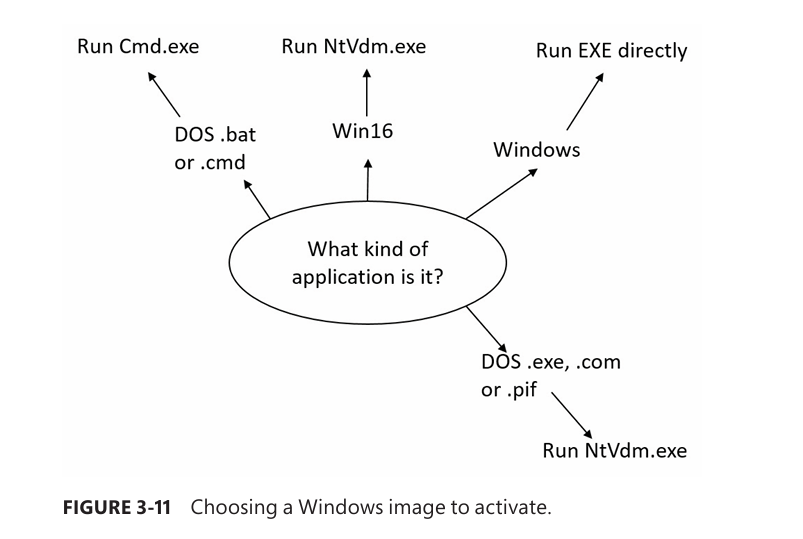

## Stage 2 – Opening the Image to Be Executed (NtCreateUserProcess)

> Execution is now in **kernel mode** inside the `NtCreateUserProcess` system call.

---

### 1. Argument Re-validation (Kernel Trust Boundary)

- Kernel **re-validates all arguments**.
- Prevents user-mode tricks that bypass `Ntdll.dll` and pass:
    - Malformed
    - Bogus
    - Malicious parameters
- Internal structure is built to hold all creation data.
    

---

### 2. Image Resolution & Section Object Creation
- Kernel locates the **correct Windows image** to execute.
- Creates a **section object** for the image:
    - Not mapped yet 
    - Prepared for later address-space mapping 
- Failure returns control to `CreateProcessInternalW`,  
    which may retry execution using fallback logic.

---

### 3. Protected Process Signing Check

- If process is **protected**:
    - Code signing policy is enforced.
- Unsigned or improperly signed images fail.
    

---

### 4. Modern (AppX) Licensing Validation
- If process is **modern (AppX)**:
    - License check is performed  
- **Inbox apps** (preinstalled) → always allowed
- If **sideloading enabled**:
    - Any properly signed app may run
- Otherwise, execution is denied.
    
---

### 5. Trustlet Handling (Secure Kernel)

- If process is a **Trustlet**:
    - Section object is created with **secure-kernel access flag**
- Required for isolated execution in VTL1.
    

---

### 6. Windows EXE Validation

- If file is a **Windows EXE**:
    - File is opened
    - Section object is created
- Successful section creation ≠ valid Windows image:
    - **POSIX executable** → fail (POSIX unsupported)
    - **DLL** → fail (cannot execute directly)
        

---

### 7. Image File Execution Options (IFEO) – Debugger Redirection

- Registry key checked:
    
    `HKLM\Software\Microsoft\Windows NT\CurrentVersion\     Image File Execution Options\<ImageName>`
    
- If **Debugger** value exists:
    
    - Image to run becomes debugger path
        
    - `CreateProcessInternalW` **restarts at Stage 1**
        
- Commonly used for:
    
    - Debugging service startup
        
    - Malware persistence
        
    - Process hijacking
        

---

### 8. Non-Windows Image Resolution (Support Images)

Windows **never directly runs non-Windows executables**.  
Instead, it uses **support executables**.

#### a) MS-DOS (.exe / .com / .pif) — x86 32-bit only

- Windows subsystem checks for existing **NTVDM** process
    
- If exists:
    
    - VDM executes program
        
    - `CreateProcessInternalW` returns
        
- If not:
    
    - Image becomes `Ntvdm.exe`
        
    - Restart at Stage 1
        

Registry:

`HKLM\SYSTEM\CurrentControlSet\Control\WOW\cmdline`

---

#### b) Batch Files (.bat / .cmd)

- Image becomes **Cmd.exe**
    
- Command passed as:
    
    `cmd.exe /c <batchfile>`
    
- Restart at Stage 1
    

---

#### c) Win16 Applications (x86 only)

- Decision: **shared VDM vs separate VDM**
    
- Controlled by:
    
    - `CREATE_SEPARATE_WOW_VDM`
        
    - `CREATE_SHARED_WOW_VDM`
        
    - Registry default:
        
        `HKLM\SYSTEM\CurrentControlSet\Control\WOW\DefaultSeparateVDM`
        
- Shared VDM usable only if:
    
    - Same desktop
        
    - Same security context
        
- Otherwise:
    
    - New `Ntvdm.exe` instance created
        
    - Restart at Stage 1
        

---

### Key Takeaways

- Kernel strictly validates images before execution
    
- **IFEO Debugger** can fully replace the executed image
    
- Non-Windows binaries are always run via **Windows support processes**
    
- Process creation may **loop back to Stage 1** multiple times