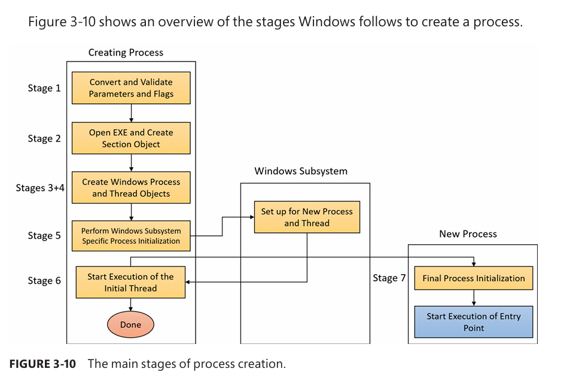

# Create Process Flow
- All documented process creation functions eventually leads to `CreateProcessInternalW`.
- High level overview of steps:
1. Validate parameters; convert Windows subsystem flags and options to their native counter parts; parse, validate, and convert the attribute list to its native counterpart. 
2. Open the image file (.exe) to be executed inside the process. 
3. Create the Windows executive process object. 
4. Create the initial thread (stack, context, and Windows executive thread object). 
5. Perform post-creation, Windows subsystem–specific process initialization. 
6. Start execution of the initial thread (unless the CREATE_SUSPENDED flag was specified). 
7. In the context of the new process and thread, complete the initialization of the address space (for example, load required DLLs) and begin execution of the program’s entry point.

# ✅ Process Creation: What You Should Actually Remember

## 1️⃣ Process creation is **phased**, not atomic

This is _the_ most important mental model.

You should remember that **a process exists before any user code runs**.

Rough phases:

1. User-mode request (`CreateProcess`)
    
2. Kernel bookkeeping (EPROCESS/KPROCESS)
    
3. Address space + image mapping
    
4. Initial thread creation
    
5. User-mode startup (`ntdll → kernel32 → main`)
    

🔴 **Why this matters**

- Injection can happen _before_ main
    
- Security identity is set early
    
- Suspended processes are fully “real” processes
    

---

## 2️⃣ EPROCESS = identity, security, legitimacy

You do **not** need field-level details, but you _must_ know what it represents.

Remember:

- EPROCESS is the kernel’s definition of:
    
    - **Who the process is**
        
    - **What it’s allowed to do**
        
- It binds together:
    
    - Token
        
    - Parent PID
        
    - Image name/path
        
    - Session
        
    - Protection level (PP/PPL)
        
    - Job membership
        

🔴 **Security relevance**

- Parent spoofing works by influencing EPROCESS at creation
    
- PP/PPL enforcement starts here
    
- Token inheritance is locked in here
    

---

## 3️⃣ KPROCESS = scheduling only

Simple but important distinction.

- KPROCESS:
    
    - Kernel-mode only
        
    - Used by scheduler
        
    - No access checks
        

🟡 Why remember it?

- Not everything “process-related” is security-related
    
- Helps separate _execution_ from _identity_
    

---

## 4️⃣ Token assignment happens **once** (initially)

You don’t need token internals here, but remember:

- Primary token is:
    
    - Inherited from parent
        
    - Or replaced via explicit creation flags
        
- Privileges, SID, integrity level are decided here
    

🔴 Why this matters:

- Privilege escalation ≠ “flip a bit later”
    
- Many security decisions are made before user-mode starts
    

---

## 5️⃣ Parent PID is a **creation-time property**

This one is huge for detection.

Remember:

- The kernel sets the parent during creation
    
- Changing it later doesn’t change kernel truth
    
- PPID spoofing must happen _during_ creation
    

🔴 Detection insight:

- EDR correlates parent → child based on this
    
- Suspicious ancestry = creation-time artifact
    

---

## 6️⃣ Image mapping ≠ execution

This is subtle but critical.

Remember:

- Image is mapped into memory
    
- Threads are created
    
- **No user code runs yet**
    

🔴 Why attackers care:

- Process hollowing
    
- Early APC injection
    
- DLL injection before entry point
    

---

## 7️⃣ Initial thread ≠ “main()”

Remember the startup chain (no need to memorize functions):

`Kernel → ntdll → kernel32 → CRT → main / WinMain`

🔴 Why this matters:

- Hooks often target early user-mode stages
    
- Malware can intercept before application logic
    

---

## 8️⃣ Why process creation is noisy (defender view)

Even if you don’t remember all callbacks, remember this:

- Process creation triggers:
    
    - Kernel callbacks
        
    - ETW events
        
    - Handle & object manager activity
        

🔴 Defender takeaway:

- Creation is one of the **most observable** actions
    
- That’s why attackers try to “blend in”
    

---

# 🧠 One-sentence mental model (memorize this)

> **Process creation is the kernel constructing an identity (EPROCESS), giving it security context (token), memory (address space), and a thread — _before_ any user code runs.**

If that sentence is clear in your head, you’re good.

---

# 🧾 What should stay as reference only

You do **not** need to remember:

- Exact kernel routines
    
- Internal helper function names
    
- Lock ordering
    
- Field offsets
    
- Object allocation details
    

Those are lookup material.

---
# Self-Check

## 1️⃣ Why can a suspended process be injected before execution?

### Your answer

> because the image of executable code is mapped in memory but is not executed yet, one could then open handle to that process, and write to it and resumethread

### ✅ Correct

### 🔧 Refined version (keep this in your head)

> Because the kernel has already created a valid process (EPROCESS), address space, and initial thread, **but the thread has not entered user-mode execution yet**.

Key refinements:

- Injection does **not** require the image to be executed
    
- What matters is:
    
    - Process object exists
        
    - Memory manager is ready
        
    - Thread exists but is suspended
        

This is why:

- Hollowing
    
- Early APC injection
    
- Remote thread injection
    

…are possible _before_ `main()`.

---

## 2️⃣ Why must PPID spoofing happen at creation time?

### Your answer

> because ppid is set during process creating by setting attribute, and after this it can not be changed

### ✅ Correct

### 🔧 Refined version

> Because the parent process ID is assigned by the kernel during EPROCESS initialization, and there is **no supported mechanism to change the kernel’s recorded parent afterward**.

Extra nuance (important for detection):

- Tools may _display_ a different parent
    
- Kernel truth (EPROCESS → Parent) remains unchanged
    
- EDRs rely on the kernel’s value, not user-mode views
    

---

## 3️⃣ Why does a process “exist” before main runs?

### Your answer

> the process is mapped into memory before code from main is called

### ✅ Mostly correct

### 🔧 Sharpen it slightly

> Because process creation involves **kernel object creation and identity establishment first**, while user-mode code execution happens later.

More accurate phrasing:

- The process exists when:
    
    - EPROCESS is allocated
        
    - Token is assigned
        
    - Address space is created
        
- Execution begins only after:
    
    - Initial thread transitions to user mode
        
    - Startup routines complete
        

This distinction is **core to Windows design**.

---

## 4️⃣ Why can EDR see process creation reliably?

### Your answer

> because it relies on EPROCESS data structure which can not be altered by the user

### ✅ Correct

### 🔧 Make it defender-grade precise

> Because process creation is a **kernel-mediated event** that results in an EPROCESS object, which is observable via kernel callbacks and ETW, and cannot be hidden from user mode.

Important nuance:

- User-mode malware can hide:
    
    - Windows APIs
        
    - Tool output
        
- It **cannot**:
    
    - Avoid kernel object creation
        
    - Bypass kernel notifications (without a kernel exploit)
        

That’s why:

- Process creation is one of the _strongest signals_ defenders have
    

---

# 🧠 Final Polished Answers (what you should remember)

If you had to compress everything into **four gold statements**, use these:

1. **Suspended processes can be injected because the kernel has finished creating the process and memory, but user-mode execution has not started yet.**
    
2. **PPID is a kernel-assigned identity set during process creation and cannot be legitimately changed afterward.**
    
3. **A process exists once the kernel creates its objects and security context — execution is a later phase.**
    
4. **Process creation is always visible because it requires kernel object creation, which EDR observes via callbacks and ETW.**
    

If those are clear → you’ve _mastered_ this section.