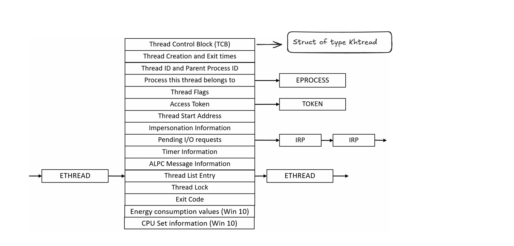
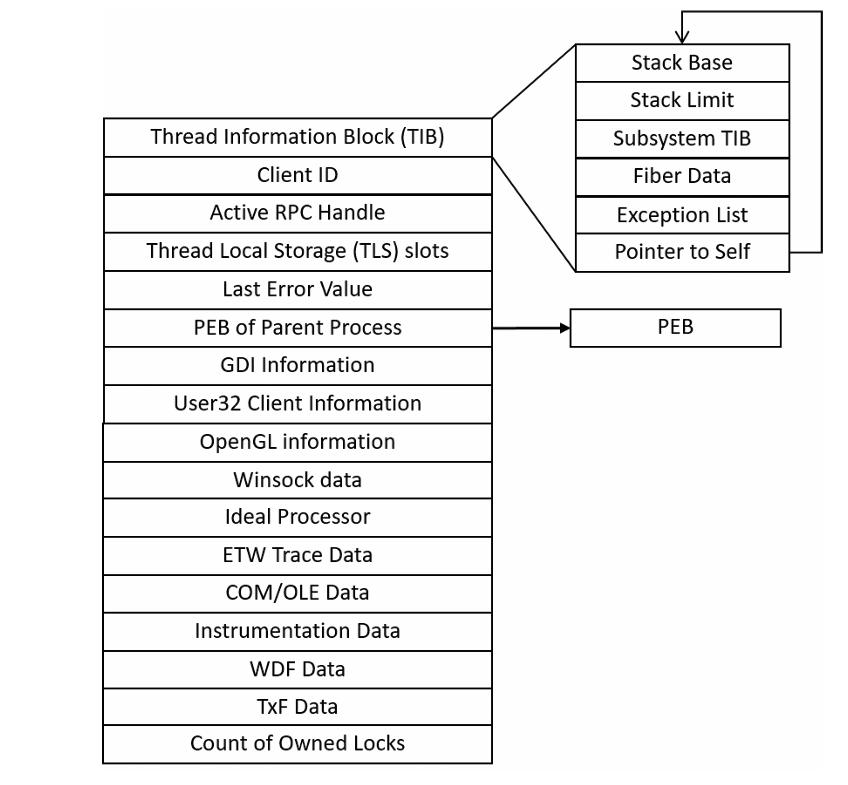
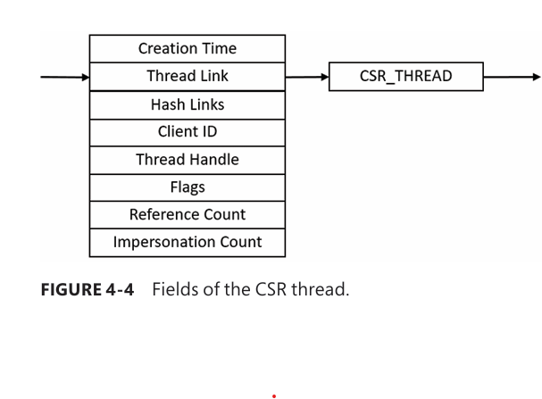
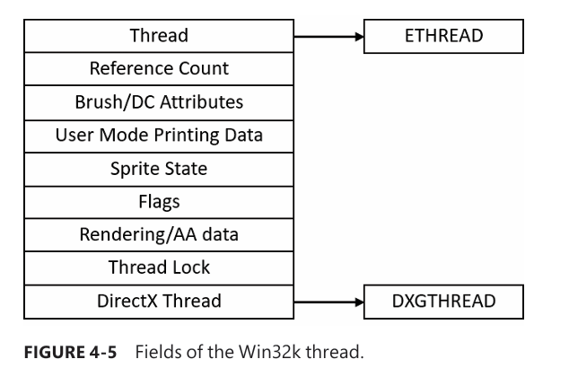
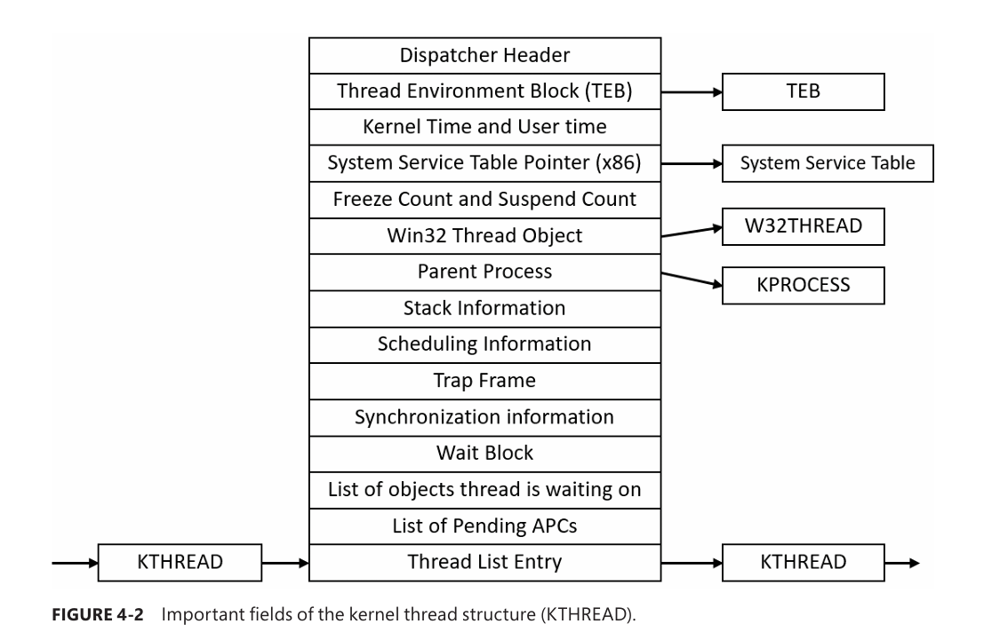

# Threads
- To create a thread
    - `CreateThread`
    - `CreateRemoteThread`
        - Takes an extra arguement, handle to target process, commonly used by debuggers. Debugger injects threads, and calls `DebugBreak` function.
        - Obtain internal information about another process, legitimate or malicious purpose.
    - `CreateRemoteThreadEx`. 
        - The above 2 functions calls this functions in the end with appropriate defaults.
        - It then finally calls `NtCreateThreadEx`.
    - To create thread in kernel mode `PsCreateSystemThread`

# Data Structures
- At OS level thread represented by execute thread object.
- Executive thread object encapsulates ETHREAD, which then points to KTHREAD.

### ETHREAD

- TCB (Thread Control Block), KTHREAD struct, contains info necessary for scheduling, synchornization and time keeping functions.

### Thread Environment Block (TEB)
- Important fields of TEB.

- TIB mainly existetd for compatibility with OS/2 and Win9x applications.
- This exists in Process Address space, instead of System Address SPace

### CS_THREAD

- Maintained by each csrss process within a session.
- Threads are registered with csrss wwhen they send their first message to Csrss.
CSRSS (Client/Server Runtime Subsystem) exists to implement **Win32 semantics that don’t belong in the kernel**.

So it maintains **its own per-thread data** for things like:

- Console state
    
- Thread-specific Win32 info
    
- GUI / USER / GDI-related bookkeeping
    
- CSR handles and message state
    

👉 This structure answers:  
**“What Win32 responsibilities does this thread have?”**

---

## Why can’t Windows just put this in ETHREAD?

Because **Win32 is not the kernel’s job**.

Key reasons:

### 🔹 Separation of concerns

- Kernel = scheduling, memory, security
    
- CSRSS = Win32 behavior (consoles, process/thread lifetime rules, etc.)
    

Putting Win32-specific fields into ETHREAD would:

- Bloat every thread (even drivers, system threads)
    
- Tie kernel stability to Win32 bugs
    
- Break subsystem modularity
    

---

### 🔹 User-mode fault isolation

CSRSS runs in **user mode**.

If CSRSS:

- Leaks memory
    
- Corrupts its thread table
    
- Crashes
    

👉 The kernel **does not go down with it**

This is _huge_ for OS reliability.

---

### 🔹 Historical reasons (but still valid)

Originally:

- Win32, POSIX, OS/2 subsystems all existed
    
- Each subsystem could maintain **its own per-thread metadata**
    

CSRSS being the Win32 subsystem keeps this design alive.


### W32THREAD

- Contains useful info for GDI subsystem (brushes and Device Context attributes), DirextX.


```
User-mode (Win32 subsystem)
 └── CSRSS Thread Object
       │
       ▼
Kernel-mode (Executive)
 └── ETHREAD
       │
       ▼
Kernel-mode (Scheduler)
 └── KTHREAD

```

### KTHREAD

- TCB (Thread Control Block), KTHREAD struct, contains info necessary for scheduling, synchornization and time keeping functions.