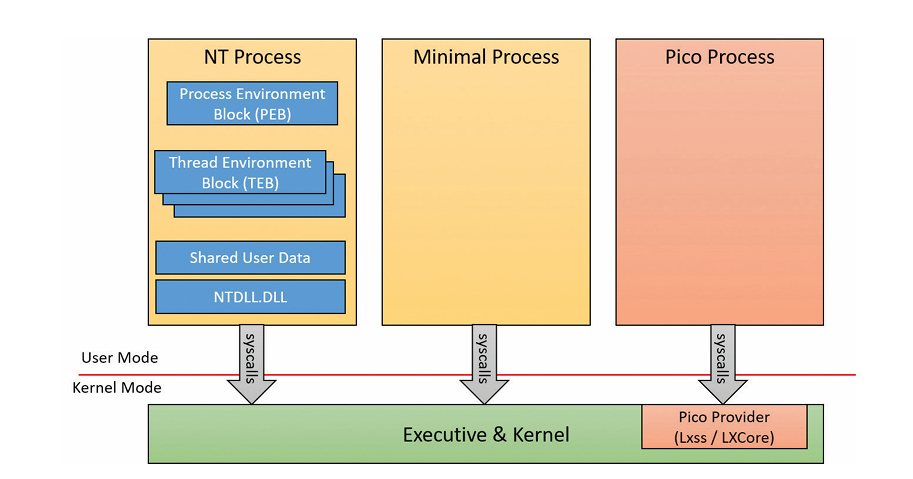

# Process Types in Windows (Windows Internals – Notes)

## 1. Not all processes exist to run user-mode code

Most processes:

- Exist to execute **user-mode applications**
    
- Contain many structures:
    
    - User-mode virtual address space
        
    - PEB / TEB
        
    - Loaded executable image
        
    - NTDLL, loader data, API sets
        

However, **some processes are not meant to execute user-mode code at all**.

---

## 2. System Process (special-purpose process)

The **System process** is used as a **container**, not a normal application.

Purpose:

- Hosts **most kernel/system threads**
    
    - Prevents their CPU time from being charged to arbitrary user processes
        
- Owns **kernel handles**
    
    - Prevents drivers’ handles from being associated with user applications
        

Key idea:

> The System process exists mainly for _accounting, ownership, and structure_, not execution of user-mode programs.

---

## 3. Minimal Processes

### What is a minimal process?

A **minimal process** is created when:

- `NtCreateProcessEx` is called
    
- Caller is **kernel-mode**
    
- A specific **minimal flag** is supplied
    
- Internally invokes `PsCreateMinimalProcess`
    

This creates a process **without most user-mode infrastructure**.

---

### Structures NOT present in a minimal process

A minimal process has:

- ❌ No user-mode address space
    
    - No PEB
        
- ❌ No NTDLL mapped
    
    - No loader
        
    - No API Set mappings
        
- ❌ No executable image
    
    - No section object
        
    - Process name may be empty or arbitrary
        
- ❌ No user-mode thread data
    
    - No TEB
        
    - No user-mode stack
        

Technical detail:

- `Minimal` flag is set in **EPROCESS**
    
- All threads become **minimal threads**
    

---

### Why minimal processes exist

- Allow **kernel components** limited interaction with process abstractions
    
- Avoid exposing or allocating user-mode memory
    
- Reduce attack surface and overhead
    

---

### Minimal processes in Windows 10+

Windows 10 includes at least:

- **System process**
    
- **Memory Compression process**
    

Optional:

- **Secure System process**
    
    - Exists when **Virtualization-Based Security (VBS)** is enabled
        

---

### Minimal processes via WSL

Enabling **Windows Subsystem for Linux (WSL)**:

- Installs a **Pico Provider**
    
- Uses:
    
    - `Lxss.sys`
        
    - `LxCore.sys`
        

These enable another class of processes: **Pico processes**

---

## 4. Pico Processes

### What are Pico processes?

Pico processes:

- Are controlled almost entirely by a **Pico Provider**
    
- Allow Windows to run **non-Windows user-mode binaries**
    
- Enable emulation of a **foreign OS kernel behavior**
    

This design is based on:

- Microsoft Research’s **Drawbridge** project
    

Used by:

- **WSL**
    
- **SQL Server for Linux** (via a Library OS)
    

---

### Pico Provider requirements

To support Pico processes:

- A **Pico Provider driver** must register via `PsRegisterPicoProvider`
    
- Very strict rules apply:
    
    - Must load **before any third-party drivers**
        
    - Only a small set of Microsoft core drivers allowed
        
    - Driver must be:
        
        - Microsoft-signed
            
        - Have **Windows Component EKU**
            
- Only **one Pico Provider** allowed system-wide
    

In WSL:

- `Lxss.sys` initially registers
    
- Later hands control to `LxCore.sys`
    

---

## 5. Pico Provider → Kernel APIs (control over Pico processes)

When registered, the Pico Provider receives function pointers to:

### Process & thread management

- Create Pico processes
    
- Create Pico threads
    
- Terminate processes/threads
    
- Suspend/resume threads
    

### Context & execution control

- Get/set **process and thread context**
    
    - Stored in `PicoContext` field (EPROCESS / ETHREAD)
        
- Get/set CPU register state (`CONTEXT`)
    
- Modify **FS / GS segment registers**
    
    - Used for thread-local storage (e.g., Linux TLS)
        

---

## 6. Kernel → Pico Provider callbacks

The kernel invokes Pico Provider callbacks when:

- A Pico thread issues a **SYSCALL**
    
- An **exception** occurs
    
- A fault occurs during **MDL probe & lock**
    
- A process name is requested
    
- **ETW** requests a user-mode stack trace
    
- A handle open is attempted on Pico process/thread
    
- Process termination is requested
    
- A Pico process or thread terminates unexpectedly
    

This gives the provider **near-total visibility and control**.

---

## 7. Security: Kernel Patch Protection (KPP)

Pico Providers leverage **Kernel Patch Protection** to:

- Protect callback tables
    
- Protect syscall hooks
    
- Prevent malicious providers from hijacking execution
    

---

## 8. Why Pico processes work

Because:

- The provider intercepts **all meaningful user↔kernel transitions**
    
- It can emulate:
    
    - System calls
        
    - Exceptions
        
    - Process behavior
        

Limitations:

- Windows still controls:
    
    - Thread scheduling
        
    - Memory commit rules
        

Well-written applications should not depend on these internals.

---

## 9. Big Picture Comparison

- **Regular NT process**
    
    - Full user-mode execution
        
- **Minimal process**
    
    - Kernel-focused
        
    - No user-mode infrastructure
        
- **Pico process**
    
    - User-mode execution
        
    - Controlled by a foreign-kernel emulation layer
        

---

## 10. Key takeaway (one-liner)

> Minimal processes strip away user-mode execution, while Pico

